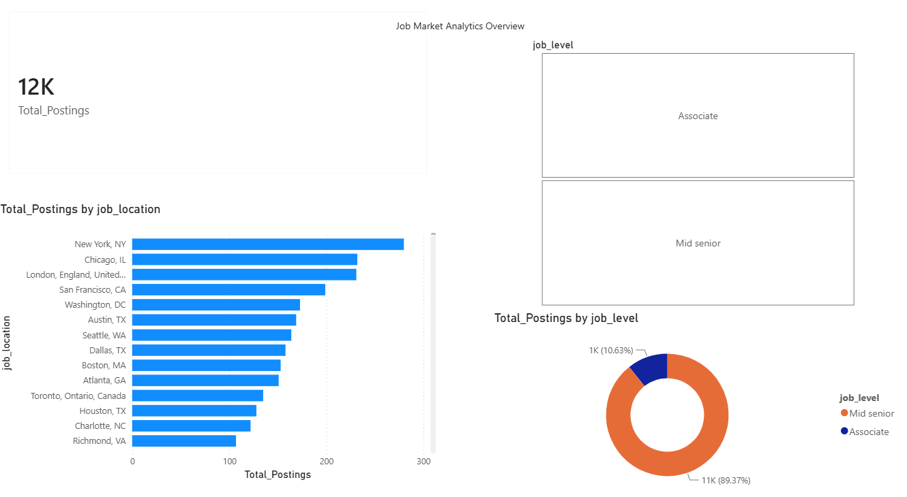
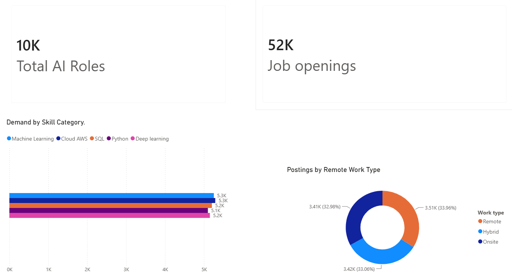
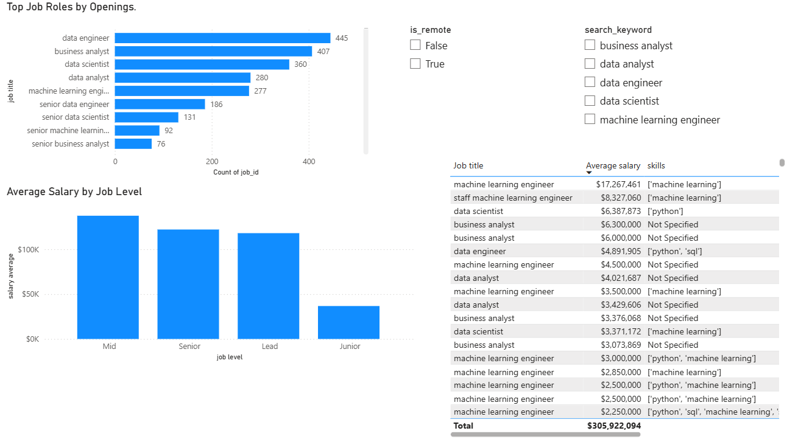

# Job Market Analytics Project

A simple data analytics project to track in-demand tech skills, experience levels, and hiring trends for data related jobs  using Python, SQL, and Power BI.

## What it does

When looking for a job, it's easy to get overwhelmed by conflicting advice on what skills to learn. This project takes real job listing data, cleans it up, and answers a few practical questions:
- Which programming languages and tools (like Python, SQL, or Power BI) pop up the most?
- How many years of experience do employers actually ask for?
- Where are most of these jobs located?
- Which tools and languages are most frequently requested together ?
- Are remote roles more common for certain skills ?

## Tech stack

- **Python** (Pandas, NumPy) for cleaning and parsing data
- **SQL** for storing data and running queries
- **Power BI** for building charts and dashboards
- **GitHub** for version control

## Workflow

1. **Get the data:** Download job posting datasets containing listings, descriptions, and requirements.
2. **Clean it up:** Use Python and Pandas to drop duplicates, fix messy text, and extract specific keywords like skills and locations.
3. **Explore:** Run quick checks in Jupyter notebooks to spot patterns or trends in the data.
4. **Store in SQL:** Load the clean data into a database to practice writing queries and aggregations.
5. **Visualize:** Connect the data to Power BI to build a dashboard and charts.

## Folder structure

- `data/` – Raw and cleaned CSV files
- `notebooks/` – Jupyter notebooks for playing around with the data
- `sql/` – Database queries
- `reports/` – Power BI files
- `visuals/` – Saved charts and screenshots

##  Key Findings & Insights

## 💡 𝙺𝚎𝚢 𝙵𝚒𝚗𝚍𝚒𝚗𝚐𝚜

Out of 52,000 job postings analyzed (including over 10,000 AI roles), a few clear patterns emerged:

*  **𝚁𝚘𝚕𝚎 𝙳𝚎𝚖𝚊𝚗𝚍:** Data Engineers took the top spot with 445 open listings, followed by Business Analysts (407), Data Scientists (360), and Data Analysts (280).
*  **𝚃𝚘𝚙 𝚂𝚔𝚒𝚕𝚕𝚜:** Machine Learning and Cloud/AWS were the most requested technical skills at ~5.3k listings each, with SQL and Deep Learning right behind at ~5.2k. Python stayed consistently high across almost all roles at ~5.1k postings.
*  **𝚆𝚘𝚛𝚔 𝙻𝚘𝚌𝚊𝚝𝚒𝚘𝚗:** Listings were split almost evenly three ways—Remote (34%), Hybrid (33%), and Onsite (33%).
*  **𝙴𝚡𝚙𝚎𝚛𝚒𝚎𝚗𝚌𝚎 𝙻𝚎𝚟𝚎𝚕𝚜:** The market heavily favors mid-to-senior talent. Roughly 89% of listings targeted mid-senior roles (~11k postings), while associate/entry-level roles made up just 11% (~1k postings).
*  **𝙷𝚒𝚛𝚒𝚗𝚐 𝙷𝚞𝚋𝚜:** New York led all cities in total job volume, followed by Chicago, London, San Francisco, and Washington, D.C.


##  Dashboard Overview

### 1. Market Overview & Seniority Distribution


### 2. Skill Demand & Remote Work Breakdown


### 3. Top Roles, Salary & Job Titles Analysis


---

##  Tech Stack & Tools

* **Data Processing & EDA:** Python (Pandas, NumPy, Jupyter Notebooks)
* **Database & Querying:** SQL (Aggregations, Grouping, Skill Extraction)
* **Visualization & BI:** Power BI (DAX, Interactive Slicers, Custom Layouts)
* **Version Control:** Git & GitHub

##  ʜᴏᴡ ᴛᴏ ᴇxᴘʟᴏʀᴇ & ʀᴇᴘʀᴏᴅᴜᴄᴇ

### 1. ᴄʟᴏɴᴇ ᴛʜᴇ ʀᴇᴘᴏsɪᴛᴏʀʏ
```bash
git clone [https://github.com/AshfordKipleting1960/Job-market-analytics.git](https://github.com/AshfordKipleting1960/Job-market-analytics.git)
cd Job-market-analytics
```

### 2. sᴇᴛ ᴜᴘ ᴇɴᴠɪʀᴏɴᴍᴇɴᴛ & ᴅᴇᴘᴇɴᴅᴇɴᴄɪᴇs
```bash
# Using Makefile
make venv
source venv/bin/activate  # On Windows: venv\Scripts\activate
make install

# Or manually using pip:
pip install -r requirements.txt
```

### 3. ʀᴜɴ ᴛʜᴇ ᴇᴛʟ ᴘɪᴘᴇʟɪɴᴇ
Extracts raw CSVs from `data/raw/`, cleans fields, drops duplicates, and exports structured CSVs to `data/cleaned/`:

```bash
make run-etl
# Or manually: python scripts/etl.py
```
### 4. ʟᴏᴀᴅ ᴅᴀᴛᴀ ɪɴᴛᴏ ᴛʜᴇ ᴅᴀᴛᴀʙᴀsᴇ
Executes `sql/schema.sql` and bulk loads the cleaned dataset into a local SQLite database (`data/job_market.db`):

```bash
make load-db
# Or manually: python scripts/load_db.py
```

### 5. ʀᴜɴ ᴜɴɪᴛ ᴛᴇsᴛs
Verify data transformation functions using `pytest`:

```bash
make test
# Or manually: pytest -v
```

### 5. ᴇxᴘʟᴏʀᴇ sǫʟ ǫᴜᴇʀɪᴇs & ᴘᴏᴡᴇʀ ʙɪ ʀᴇᴘᴏʀᴛs
*  **ᴠɪᴇᴡ sǫʟ ǫᴜᴇʀɪᴇs:** Check out `.sql` scripts inside [`sql/`](./sql/) for data aggregation logic.
*  **ʀᴇᴠɪᴇᴡ ᴅᴀᴛᴀ ᴘʀᴇᴘ:** Inspect Jupyter Notebooks in [`notebooks/`](./notebooks/) for exploratory routines.
*  **ɪɴᴛᴇʀᴀᴄᴛɪᴠᴇ ʀᴇᴘᴏʀᴛ:** Open the `.pbix` file inside [`reports/`](./reports/) using **Powe
